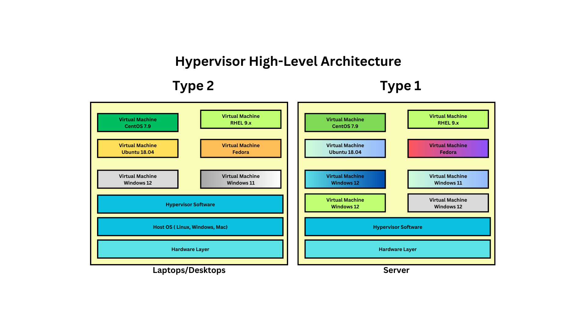

# Day 1

## How to install many OS in desktop without virtualization ( Dual booting or Multi Booting )?
<pre>
- Boot loaders system utility let's you install multiple OS in your laptop/desktop/workstation
- Once you boot the system, it runs Power On Self Test(BIOS POST)
- BIOS will instruct the CPU to run the Boot loader utility
- Boot Loader utility is installed in Sector 0, Byte 0 in your Hard Disk, Sector 0, Byte 0 is referred as Master Boot Record(MBR)
- The MBR size is just 512 bytes, which means the bootloader has to fit within 512 bytes
- The Boot loader, scans the system looking for hard disks, scans for Operating Systems installed in it
- If the Boot loader detects multiple OS, it prepares a menu and gives an option for us to choose which OS you wish to boot into
- Only One OS can be active at any point of time
</pre> 

## Hypervisor Overview
<pre>
- is nothing virtualization technology
- virtualization allows us to run multiple OS in the same machine simulataneously
- i.e many OS can run in parallel
- Processor with 
  - Intel Processor
    - Virtualization Feature supported is VT-X
  - AMD Processor
    - Virtualization Feature supported is AMD-V
- In BIOS, we need to ensure Virtualization is Enabled
- Each Virtual Machine(VM) represents a fully functional Operating System
- The OS that is installed with VM is called Guest OS
- The Guest OS has its own dedicated OS Kernel and hardware resources like CPU, RAM, Storage, Network Card(virtual) & Graphics Card(virtual)
- There are two types of Hypervisors
  1. Type 1 aka Bare Metal Hypervisor
     - doesn't require OS to install Type 1 Hypervisor
     - used in Servers and Workstations only
     - examples
       - KVM 
       - VMWare ESXi, VMWare vSphere
  2. Type 2
     - used in laptops/desktops/workstations
     - Type 2 Hypervisors are installed on top of Host OS ( Windows, Linux, Mac )
     - examples
       - VMWare Workstation ( Linux & Windows )
       - VMWare Fusion ( Mac OS-X )
       - Oracle VirtualBox ( Mac, Linux & Windows )
       - Parallels ( Mac OS-X )
       - Hyper-V ( Windows )
- this type of virtualization is considered heavy weight, because each VM requires dedicated hardware resources
  - CPU
  - RAM
  - Storage
- though virtualization technology results in huge cost saving for an organization, it is not cheaper to the extent every engineer can be given 10~15 VMs each
</pre>

## Processor 
   - comes in 2 packages
     1. SCM ( Single Chip Module ) - one IC will host 1 Processor
     2. MCM ( Multiple Chip Module ) - one IC will host many Processors
        - one IC comes 4/8 Processors
   - each Processor comes with multiple CPU Cores
     - 32 cores
     - 64 cores
     - 128 cores
     - 256 cores
     - 512 cores
    - motherboard with 4 Processor Sockets
    - let's assume we install MCM based IC with 4 Processor on each IC
    - Total Processors - 4 x 4 = 16 Processors
    - Assume, each Processor supports 128 cores
    - Total cores = 128 x 16 = 2048 phycical cores
    - Total logical/virtual cores = 2048 x 2 = 4096

     


## Hypervisor High Level Architecture


## Linux Kernel Features that makes container technology possible
1. Namespace - Isolation
2. Control Group (CGroup) - applying resource quota restrictions

## Container Technology
<pre>
- is an application virtualization technology
- light-weight virtualization, because containers aren't allocated with dedicated hardware resources
- all the containers running in an OS shares the OS Kernel and hardware resources on the underlying Host/Guest OS
- each container represents an application or an application process
- containers aren't Operating System
- containers will never be able to replace Hypervisors
- containers are isolated by namespaces
- containers resource quota can be restricted using control group aka CGroups
- in real world, Hypervisors and containers are used in combination, hence they are completing technology not competing technology
- containers just like VMs/OS, they also get their own IP Address
- containers just like VMs/OS, they also get their own File system
- containers just like VMs/OS, they also get their own port range 0-65535 
- containers just like VMs/OS, they get their own network stack ( 7 OSI Layers )
- containers just like VMs/OS, they get thier own software defined network cards (NICs)
- it is because of these common features, people tend to compare containers with Operating system or Virtual Machines
</pre>

## What is there in an Ubuntu container?
<pre>
- package manager tool to install/uninstall/upgrade softwares
- basic unix commands
- shell
- IP address
- Dedicated Ports
- Dedicated network cards(one or more)
</pre>

## Container Runtime Overview
<pre>
- is a low-level software that manages container images and containers
- not so user-friendly, hence normally end-users don't use this directly
- examples
  - runC container runtime
  - CRI-O container runtime
</pre>

## Container Engine Overview
<pre>
- is a high-level software that manages container images and containers
- very user-friendly
- container engines depends on container runtimes to manage images and containers
- examples
  - Docker is a container engine that depends on containerd which inturn depends on runc Container Runtime
  - Podman is a container engine that depends on CRI-O container runtime
</pre>

# Docker Overview
<pre>
- Docker is developed in Golang by a company called Docker Inc
- Docker comes in 2 flavours
  - Docker Community Edition - Docker CE ( opensource )
  - Docker Enterprise Edition - Docker EE ( Commercial - Paid license )
- follows client/server architecture
- docker - is the client tool
- dockerd - is the server tool that runs as a service ( docker application container engine )
</pre>

## Docker High Level Architecture


## Demo - Installing Docker Community Edition in Ubuntu
```
# Add Docker's official GPG key:
sudo apt-get update
sudo apt-get install ca-certificates curl
sudo install -m 0755 -d /etc/apt/keyrings
sudo curl -fsSL https://download.docker.com/linux/ubuntu/gpg -o /etc/apt/keyrings/docker.asc
sudo chmod a+r /etc/apt/keyrings/docker.asc

# Add the repository to Apt sources:
echo \
  "deb [arch=$(dpkg --print-architecture) signed-by=/etc/apt/keyrings/docker.asc] https://download.docker.com/linux/ubuntu \
  $(. /etc/os-release && echo "${UBUNTU_CODENAME:-$VERSION_CODENAME}") stable" | \
  sudo tee /etc/apt/sources.list.d/docker.list > /dev/null
sudo apt-get update

sudo apt-get install -y docker-ce docker-ce-cli containerd.io docker-buildx-plugin docker-compose-plugin

sudo usermod -aG docker $USER
sudo systemctl enable docker
sudo systemctl start docker
sudo systemctl status docker
sudo $USER
docker --version
docker images
```

Expected output


## Lab - Troubleshooting Docker permission denied
<pre>
- When we install docker, docker creates an user group called docker
- as the docker client and server uses an unix socket
- each user must have access to unix socket, i.e read/write permission
- one can gain read/write permssion to the unix socket used by docker by adding the user to the usergroup docker
</pre>

The below command adds, the user to docker usergroup
```
id
su $USER
id
docker images
```

## Lab - Download a docker image from Docker Hub Website to local docker registry
```
docker pull ubuntu:latest
docker pull mysql:latest
docker pull nginx:latest
```

Expected output


## Lab - Listing Docker Images in the local Docker registry
```
docker images
```

Expected output


## Lab - Deleting a Docker Image from your local docker registry
```
docker images
docker rmi ubuntu:latest
docker images
```

Expected output

